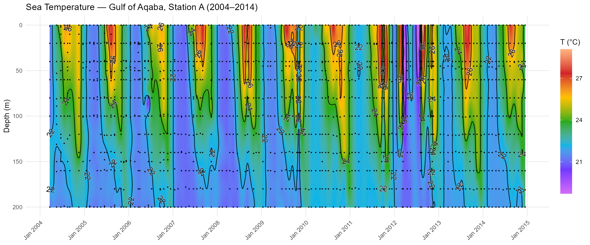

# divaodv 

> ODV-style oceanographic section plots via DIVAnd interpolation, in R.

[](https://lifecycle.r-lib.org/articles/stages.html#experimental)
[](https://opensource.org/licenses/MIT)

**divaodv** turns scattered oceanographic profile data into publication-quality
[Ocean Data View](https://odv.awi.de/)-style depth × time section plots.
Under the hood it calls [DIVAnd.jl](https://github.com/gher-ulg/DIVAnd.jl)
(Data-Interpolating Variational Analysis) via
[JuliaCall](https://cran.r-project.org/package=JuliaCall) to interpolate
observations onto a regular grid, then renders filled-contour sections with
[ggplot2](https://ggplot2.tidyverse.org/) and
[metR](https://eliocamp.github.io/metR/).

<!-- screenshot placeholder — replace with your actual plot -->
 

## Features

- **One function call** from raw data to plot: `diva_plot_odv(df, var = "Temp")`
- **DIVAnd interpolation** with configurable correlation lengths, ε², and log transforms
- **Correct metric tensor** (`pmn`) computation — correlation lengths are honoured at any grid resolution
- **ODV rainbow palette** or viridis / custom colour scales
- **Optional contour lines + labels** via `metR::geom_text_contour()` with adjustable binwidth and label density (`add_contours = TRUE`)
- **Observation overlay** showing original sampling locations as dots
- **Flexible grid resolution** via `depth_resolution` and `time_resolution` parameters
- **Returns a ggplot2 object** — fully customisable with standard ggplot layers
- **`return_data = TRUE`** mode to get the interpolated grid as a tibble for further analysis

## Prerequisites

divaodv requires a working Julia installation with DIVAnd.jl:
  
1. **Install Julia** (≥ 1.6) from <https://julialang.org/downloads/>
2. **Install DIVAnd.jl** — in the Julia REPL:
   ```julia
   using Pkg
   Pkg.add("DIVAnd")
   ```
3. **Install JuliaCall** in R:
   ```r
   install.packages("JuliaCall")
   ```

## Installation

```r
# install.packages("remotes")
remotes::install_github("Imaidanik/divaodv")
```

## Quick start

```r
library(divaodv)

# Load example data (NMP Gulf of Aqaba Station A — Temperature, upper 200 m)
df <- read.csv(system.file("extdata", "nmp_temp_200m.csv", package = "divaodv"))
df$Date <- as.Date(df$Date)

# One-liner: interpolate + plot
p <- diva_plot_odv(
  df           = df,
  var          = "Temp",
  time_corr    = 20,         # temporal correlation length (days)
  depth_corr   = 15,        # depth correlation length (metres)
  epsilon2     = 0.01,       # signal-to-noise ratio
  max_depth    = 200,
  palette      = "odv",      # classic ODV rainbow
  add_contours = TRUE        # overlay contour lines + labels
)
print(p)
```

## Controlling the grid

The interpolation grid density is set by two parameters:

| Parameter | Default | Effect |
|-----------|---------|--------|
| `depth_resolution` | 1 | Grid spacing in metres. Set to 2 to halve the depth dimension. |
| `time_resolution` | 365 | Grid points per year. 180 = bi-daily, 52 = weekly, 12 = monthly. |

```r
# Fast preview at coarse resolution
diva_plot_odv(df, "Temp", time_corr = 20, depth_corr = 15,
              time_resolution = 52, depth_resolution = 2)

# Publication quality at fine resolution
diva_plot_odv(df, "Temp", time_corr = 20, depth_corr = 15,
              time_resolution = 365, depth_resolution = 1)
```

## Variable configuration

For multi-variable workflows, use `diva_variable_config()` to create reusable
parameter sets:

```r
cfg <- diva_variable_config(
  var        = "Chl_a_ug_L",
  transform  = "log",       # log-transform before interpolation
  time_corr  = 7,
  depth_corr = 10,
  epsilon2   = 0.02,
  category   = "biological"
)

diva_plot_odv(df, var = cfg$var, time_corr = cfg$time_corr,
              depth_corr = cfg$depth_corr, epsilon2 = cfg$epsilon2,
              transform = cfg$transform)
```

The package ships with `nmp_default_config()` — a 12-variable configuration
for the NMP Gulf of Aqaba Station A 2004–2014 dataset used in the companion
methods paper.

## Contour tuning

```r
diva_plot_odv(
  df, "Temp",
  time_corr        = 20,
  depth_corr       = 15,
  add_contours     = TRUE,  # enable contour overlay
  contour_binwidth = 2,     # contour lines every 2 units
  label_binwidth   = 2,     # labels every 2 units
  label_gap        = 0,     # skip parameter for label thinning
  sample_points    = TRUE   # show observation locations
)
```

## Getting the grid data

```r
grid <- diva_plot_odv(df, "Temp", time_corr = 20, depth_corr = 15,
                      return_data = TRUE)
head(grid)
#>         Date Depth     Temp
#> 1 2004-01-15     0 22.83...
#> 2 2004-01-15     1 22.82...
```

## How it works

1. **Observations** are extracted from the input tibble, filtered for non-NA values
2. **Time is scaled** to years (fractional) for isotropic correlation handling
3. A **regular depth × time grid** is built at the specified resolution
4. The **metric tensor** (`pmn`) is computed from actual grid spacing — this ensures
   correlation lengths in metres and days/years are correctly honoured by DIVAnd
5. Values are **z-score normalised**, interpolated via `DIVAnd.DIVAndrun`, then rescaled
6. Optional **log back-transform** for biological/chemical variables
7. The grid is rendered as `geom_raster` + `geom_contour` + `metR::geom_text_contour`

## Citation

If you use divaodv in published work, please cite:

> Maidanik, I. (2026). DIVA interpolation for oceanographic time-series data:
> An R + Julia workflow for gap-filling and visualisation.
> *Limnology and Oceanography: Methods* (in preparation).

## Related

- [DIVAnd.jl](https://github.com/gher-ulg/DIVAnd.jl) — the Julia interpolation engine
- [Ocean Data View](https://odv.awi.de/) — the original ODV software by R. Schlitzer
- [metR](https://eliocamp.github.io/metR/) — meteorological/oceanographic ggplot2 extensions
- [JuliaCall](https://cran.r-project.org/package=JuliaCall) — R interface to Julia

## License

MIT © Ilia Maidanik
