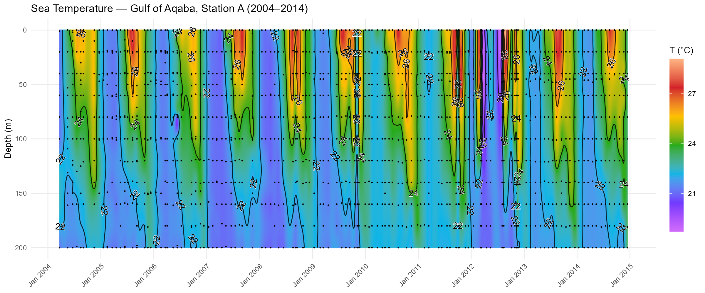

# divaodv 

> ODV-style oceanographic section plots via DIVAnd interpolation, in R.

[](https://lifecycle.r-lib.org/articles/stages.html#experimental)
[](https://opensource.org/licenses/MIT)

**divaodv** turns scattered oceanographic profile data into publication-quality
[Ocean Data View](https://odv.awi.de/)-style depth × time section plots.
Under the hood it calls [DIVAnd.jl](https://github.com/gher-ulg/DIVAnd.jl)
(Data-Interpolating Variational Analysis) via
[JuliaCall](https://cran.r-project.org/package=JuliaCall) to interpolate
observations onto a regular grid, then renders filled-contour sections with
[ggplot2](https://ggplot2.tidyverse.org/) and
[metR](https://eliocamp.github.io/metR/).

<!-- screenshot placeholder — replace with your actual plot -->
 

## Features

- **One function call** from raw data to plot: `diva_plot_odv(df, var = "Temp")`
- **DIVAnd interpolation** with configurable correlation lengths, ε², and log transforms
- **Correct metric tensor** (`pmn`) computation — correlation lengths are honoured at any grid resolution
- **ODV rainbow palette** or viridis / custom colour scales
- **Post-hoc contour control** via `odv_contours()` / `odv_contours_remove()` — explicit levels or even spacing, set or stripped without re-interpolating
- **ODV-style nonlinear colour mapping** via `scale_fill_odv()` — median and nonlinearity controls, applied without re-running DIVAnd
- **Contour lines + labels** via `metR::geom_text_contour()` with adjustable binwidth and label density
- **Observation overlay** showing original sampling locations as dots
- **Flexible grid resolution** via `depth_resolution` and `time_resolution` parameters
- **Returns a ggplot2 object** — fully customisable with standard ggplot layers
- **Cyclic time** (`cyclic_time = TRUE`) for annual climatologies — folds the year so December and January share correlation support, removing the seam
- **`return_data = TRUE`** mode to get the interpolated grid as a tibble for further analysis

## Prerequisites

divaodv requires a working Julia installation with DIVAnd.jl:
  
1. **Install Julia** (≥ 1.6) from <https://julialang.org/downloads/>
2. **Install DIVAnd.jl** — in the Julia REPL:
   ```julia
   using Pkg
   Pkg.add("DIVAnd")
   ```
3. **Install JuliaCall** in R:
   ```r
   install.packages("JuliaCall")
   ```

## Installation

```r
# install.packages("remotes")
remotes::install_github("Imaidanik/divaodv")
```

## Quick start

```r
library(divaodv)

# Load example data (NMP Gulf of Aqaba Station A — Temperature, upper 200 m)
df <- read.csv(system.file("extdata", "nmp_temp_200m.csv", package = "divaodv"))
df$Date <- as.Date(df$Date)

# One-liner: interpolate + plot
p <- diva_plot_odv(
  df        = df,
  var       = "Temp",
  time_corr = 20,         # temporal correlation length (days)
  depth_corr = 15,        # depth correlation length (metres)
  epsilon2  = 0.01,       # signal-to-noise ratio
  max_depth = 200,
  palette   = "odv"       # classic ODV rainbow
)
print(p)
```

## Controlling the grid

The interpolation grid density is set by two parameters:

| Parameter | Default | Effect |
|-----------|---------|--------|
| `depth_resolution` | 1 | Grid spacing in metres. Set to 2 to halve the depth dimension. |
| `time_resolution` | 365 | Grid points per year. 180 = bi-daily, 52 = weekly, 12 = monthly. |

```r
# Fast preview at coarse resolution
diva_plot_odv(df, "Temp", time_corr = 20, depth_corr = 15,
              time_resolution = 52, depth_resolution = 2)

# Publication quality at fine resolution
diva_plot_odv(df, "Temp", time_corr = 20, depth_corr = 15,
              time_resolution = 365, depth_resolution = 1)
```

## Variable configuration

For multi-variable workflows, use `diva_variable_config()` to create reusable
parameter sets:

```r
cfg <- diva_variable_config(
  var        = "Chl_a_ug_L",
  transform  = "log",       # log-transform before interpolation
  time_corr  = 7,
  depth_corr = 10,
  epsilon2   = 0.02,
  category   = "biological"
)

diva_plot_odv(df, var = cfg$var, time_corr = cfg$time_corr,
              depth_corr = cfg$depth_corr, epsilon2 = cfg$epsilon2,
              transform = cfg$transform)
```

The package ships with `nmp_default_config()` — a 12-variable configuration
for the NMP Gulf of Aqaba Station A 2004–2014 dataset used in the companion
methods paper.

## Contour tuning

At build time:

```r
diva_plot_odv(
  df, "Temp",
  time_corr        = 20,
  depth_corr       = 15,
  add_contours     = TRUE,
  contour_binwidth = 2,          # contour lines every 2 units
  contour_breaks   = c(20, 22),  # or explicit levels; overrides binwidth
  label_binwidth   = 2,
  label_gap        = 0,
  sample_points    = TRUE
)
```

Or on a plot you already have — like `scale_fill_odv()`, this does not
re-run DIVAnd:

```r
p <- diva_plot_odv(df, "Temp", time_corr = 20, depth_corr = 15)

p + odv_contours(breaks = c(20, 22, 24))      # explicit levels
p + odv_contours(binwidth = 2)                # even spacing
p + odv_contours(breaks = 22, labels = FALSE) # one unlabelled isotherm
p + odv_contours_remove()                     # strip them entirely
```

`odv_contours()` replaces any contours already present rather than adding a
second set, so it is safe to call repeatedly while tuning.

## Colour mapping

Ocean Data View's Color Mapping tab exposes two controls beyond the value
range: **Median** and **Nonlinearity**. `scale_fill_odv()` reproduces their
visual effect. Skewed fields — most nutrients, chlorophyll, cell counts —
otherwise spend most of the palette on a sparse tail.

```r
p <- diva_plot_odv(df, "PO4", time_corr = 15, depth_corr = 10,
                   zlim = c(0, 2), fill_label = "PO4 (umol/kg)")

# median  = where in the range the middle colour sits
# nonlinearity = how hard to concentrate resolution there
p + scale_fill_odv(median = 0.35, nonlinearity = 0.6)
```

Because `diva_plot_odv()` returns a plain ggplot object, adding the scale
**does not re-run DIVAnd** — the interpolated grid is already in the plot.
Recolouring is instant, so you can iterate the way you would drag the ODV
sliders. The `zlim`, `palette` and `fill_label` of the host plot carry over
automatically; pass them explicitly to override.

The same two controls are available directly on `diva_plot_odv()` as
`colour_median` and `colour_nonlinearity`. Both default to a linear mapping,
so existing code is unaffected.

Only the colour *stops* move — the data and the colourbar axis stay linear, so
legend ticks remain evenly spaced and round-numbered while the colour
distribution inside the bar becomes non-uniform. Contour placement is
independent, as it is in ODV, and stays under `contour_binwidth`.


### Automatic mapping

`odv_auto_map()` fits `median` and `nonlinearity` from the interpolated field —
the palette midpoint is placed at the data median and the S-curve is matched to
the field's empirical CDF (histogram equalisation). Let the scale fit itself
with the `"auto"` sentinel (no re-interpolation):

```r
p <- diva_plot_odv(df, "PO4", time_corr = 15, depth_corr = 10, zlim = c(0, 2))
p + scale_fill_odv(median = "auto", nonlinearity = "auto")

# Or inspect the fitted values:
grid <- diva_plot_odv(df, "PO4", time_corr = 15, depth_corr = 10,
                      return_data = TRUE)
odv_auto_map(grid$PO4, limits = c(0, 2))
#>       median nonlinearity
#>        0.100        0.810
```

`diva_plot_odv(colour_median = "auto", colour_nonlinearity = "auto")` applies
the same fit at build time.

## Annual climatology (cyclic time)

To build a seasonal climatology, fold every observation onto a single reference
year (keep month/day, discard the year) and set `cyclic_time = TRUE`. The time
axis then wraps: December and January share correlation support, so the seam
between them — and the edge relaxation that comes with a non-periodic domain —
is removed. The x-axis is drawn as months.

```r
# Fold to one reference year (keep month/day), then interpolate cyclically
folded <- df
folded$Date <- as.Date(format(folded$Date, "2001-%m-%d"))   # Feb 29 -> handle first

diva_plot_odv(
  folded, "Temp",
  time_corr = 30, depth_corr = 20, epsilon2 = 0.3,
  cyclic_time = TRUE
)
```

`cyclic_time = TRUE` requires folded input: if the `Date` span exceeds one year
the function warns, because on unfolded data the wrap would stitch the earliest
and latest calendar days of the whole record together. `mask_beyond_corr` is not
supported together with `cyclic_time` and is ignored if both are set.

## Getting the grid data

```r
grid <- diva_plot_odv(df, "Temp", time_corr = 20, depth_corr = 15,
                      return_data = TRUE)
head(grid)
#>         Date Depth     Temp
#> 1 2004-01-15     0 22.83...
#> 2 2004-01-15     1 22.82...
```

## How it works

1. **Observations** are extracted from the input tibble, filtered for non-NA values
2. **Time is scaled** to years (fractional) for isotropic correlation handling
3. A **regular depth × time grid** is built at the specified resolution
4. The **metric tensor** (`pmn`) is computed from actual grid spacing — this ensures
   correlation lengths in metres and days/years are correctly honoured by DIVAnd
5. Values are **z-score normalised**, interpolated via `DIVAnd.DIVAndrun`, then rescaled
6. Optional **log back-transform** for biological/chemical variables
7. The grid is rendered as `geom_raster` + `geom_contour` + `metR::geom_text_contour`

## Citation

If you use divaodv in published work, please cite:

> Maidanik, I. (2026). DIVA interpolation for oceanographic time-series data:
> An R + Julia workflow for gap-filling and visualisation.
> *Limnology and Oceanography: Methods* (in preparation).

## Related

- [DIVAnd.jl](https://github.com/gher-ulg/DIVAnd.jl) — the Julia interpolation engine
- [Ocean Data View](https://odv.awi.de/) — the original ODV software by R. Schlitzer
- [metR](https://eliocamp.github.io/metR/) — meteorological/oceanographic ggplot2 extensions
- [JuliaCall](https://cran.r-project.org/package=JuliaCall) — R interface to Julia

## License

MIT © Ilia Maidanik